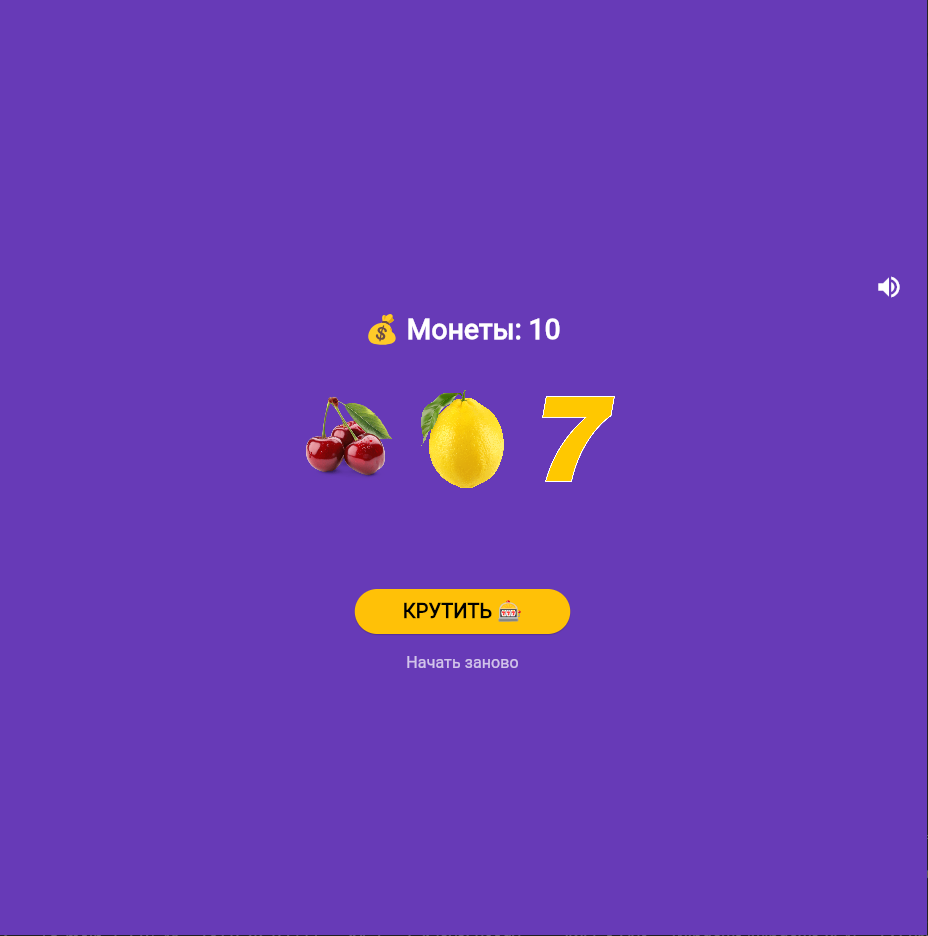
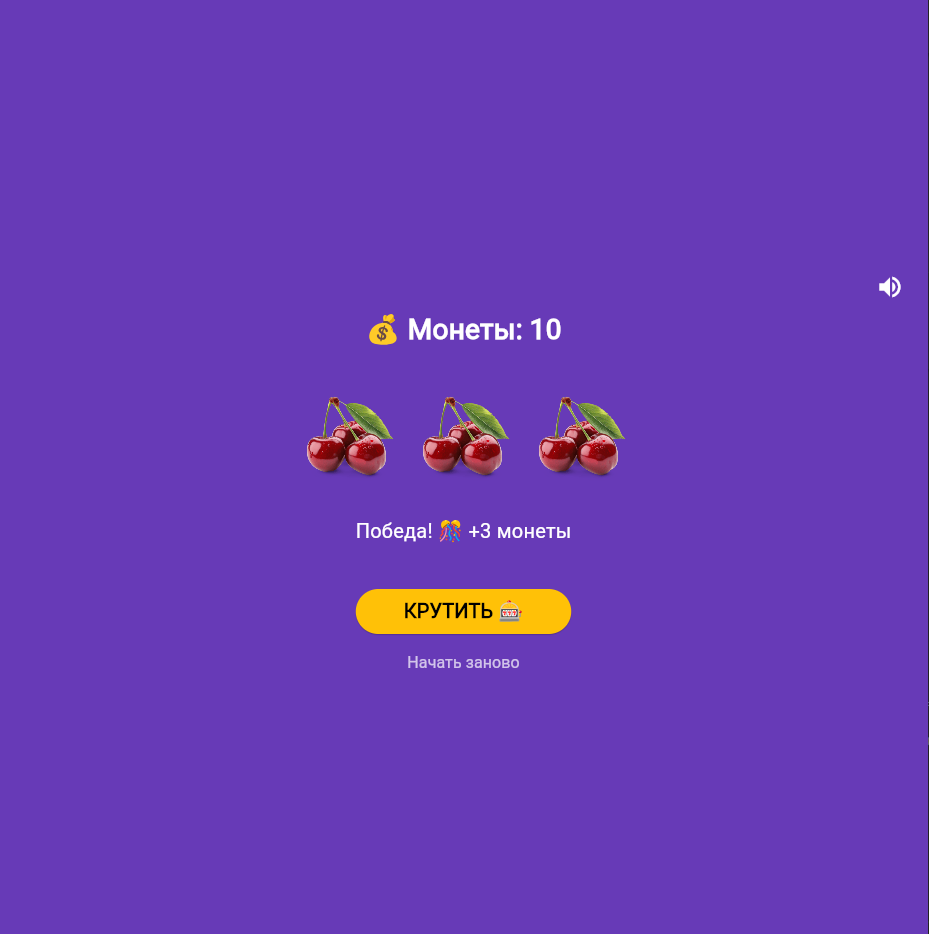
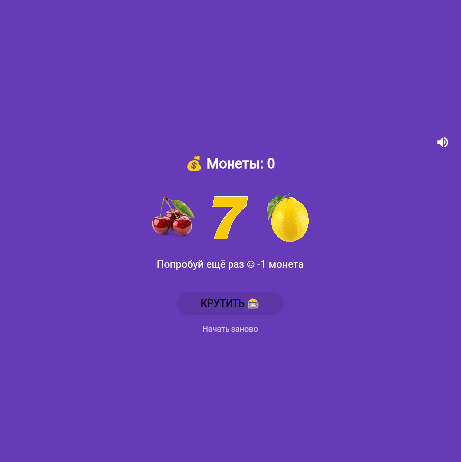

## Учебное приложение. 🎰 Слот-машина
---

Простое Flutter-приложение - симулятор казино. Крути барабаны, собирай одинаковые символы и выигрывай монеты!

### 📱 Скриншоты 
---

|Главный экран|Победа|Монеты закончились|
|-------------|-------------|-------------|
||||

### 🎮 Как играть
---

- Нажмите **КРУТИТЬ** чтобы запустить барабаны
- Три одинаковых символа - победа (+3 монеты)
- Три семёрки - джекпот (+10 монет)
- Разные символы - проигрыш (-1 монета)
- Начните заново кнопкой **Начать заново**

### 🚀 Запуск проекта
---

**Требования:** Flutter 3.x, Dart 3.x

```bash
# Клонирование репозиторий
git clone https://github.com/vvkkdehg/Flutter_Lab6_Khanov_Zhuravskiy

# Перейти в папку
cd slot_machine

# Установить зависимости
flutter pub get

# Запустить в Chrome
flutter run -d chrome
```

### 📦 Установка на Android
---

Скачайте готовый APK:
[app-release.apk](C:\Users\Student_05\Flutter_Lab6_Khanov_Zhuravskiy\assets\app-release.apk)

### 🛠 Технологии
---

- **Flutter** 3.41.2
- **Dart** 3.11.0
- Платформы: Web, Android

### 📚 Что изучено
---

- `StatefulWidget` и управление состоянием через `setState()`
- Работа с локальными изображениями через `Image.asset()`
- Генерация случайных чисел через `dart:math`
- Анимация через `async/await` и `AnimatedOpacity`
- Создание иконки в Krita и подключение через `flutter-launcher-icons`
- Сборка под Web и Android

### 👤 Автор
---

**Ханов В.В. и Журавский Е.А. -** группа ИСП-231

Лабораторная работа №6-7, 2026

