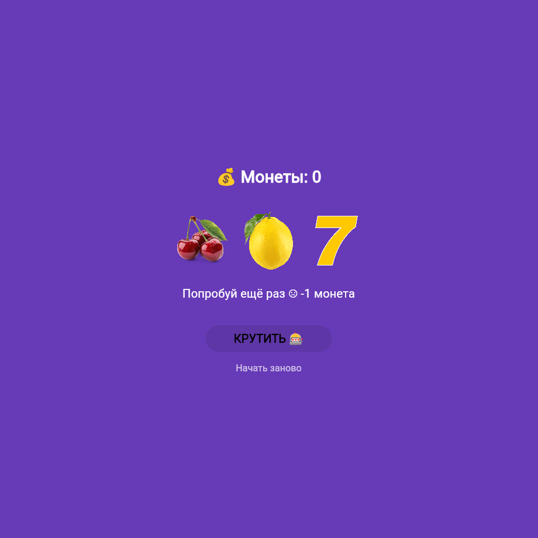

## Лабораторная работа №6. Flutter: StatefulWidget и управление состоянием

### Авторы

**ФИО:** Ханов В.В. и Журавский Е.А.

**Группа:** ИСП-231

**Дата:** 05.05.2026

### Что изучили?

- Изучили разницу между StatelessWidget и StatefulWidget
- Научились управлять состоянием приложения через setState()
- Научились подключать локальные изображения и обрабатывать нажатия кнопок — на примере слот-машины

### Скриншот приложения

### Как запустить?

1. Достать проект с GitHub
2. Открыть его в VS Code
3. Ввести `flutter run -d chrome`